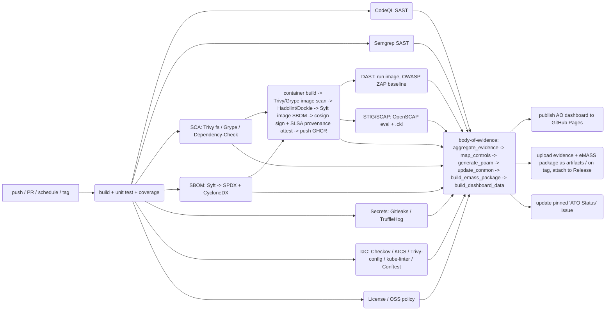

# DSOP — DoD/Navy DevSecOps Pipeline & RMF/ATO Body of Evidence

> A GitHub-native DevSecOps reference pipeline that generates and continuously maintains the
> **Body of Evidence (BoE)** required for a DoD **Risk Management Framework (RMF)** Authorization
> to Operate (ATO) / **continuous ATO (cATO)**, aligned to the **U.S. Navy RAISE 2.0** model, and
> produces an **eMASS-ready submission package** — with an **Authorizing Official (AO) dashboard**
> published from the repo via GitHub Pages.

**Everything runs on GitHub.** Source, CI/CD, SAST, SCA, SBOM, secrets scanning, IaC scanning,
container build/scan/sign, DAST, STIG/SCAP compliance, evidence aggregation, the AO review
interface, and the eMASS package build are all GitHub Actions + GitHub Pages + GitHub Releases.
No external CI server, no separate evidence store.

---

## ⚠️ Read this first — scope, authority, and disclaimers

- **This is a reference template, not an authorization.** It does not grant or imply any ATO,
  cATO, RAISE incorporation, or RPOC designation. Those decisions belong to your **Authorizing
  Official (AO)**, **Security Control Assessor (SCA)**, and (for cATO) the **DoD CISO** — and for
  RAISE, your **RPOC ISSM** and **Technical Authority (TA)**.
- **Confirm against the controlling documents.** The crosswalks here are built from the public
  versions of the governing policy (see [`compliance/references.md`](compliance/references.md)).
  Several authoritative artifacts are CAC-restricted (the **RMF Knowledge Service**, the
  **eMASS User Guide & POA&M import template**, the current **RAISE 2.0 Implementation Guide**
  annexes, DoD overlays/assignment values). Validate every mapping against the version your
  program is held to. Where this repo is uncertain, it says so inline and in
  [`compliance/references.md`](compliance/references.md).
- **Tailoring is required.** Categorization (CNSSI 1253), control selection/overlays, the
  authorization boundary, the Customer Responsibility Matrix you inherit from your platform, your
  applicable STIGs/SRGs, and your residual-risk thresholds are program-specific. This repo gives
  you the machinery and a defensible starting point — not a finished package.
- **Impact Level:** scaffolded for **IL2 / GitHub.com (GitHub Enterprise Cloud)**. IL4/IL5 deltas
  (self-hosted runners in a DoD enclave, GitHub Enterprise Server, air-gap-friendly tool sourcing,
  Iron Bank tooling images, no calls to public SaaS) are noted in
  [`docs/impact-level-notes.md`](docs/impact-level-notes.md).

---

## What this repo produces (the Body of Evidence)

Every pipeline run regenerates a normalized, machine-readable evidence set and a human dashboard:

| Artifact | Where | RMF / RAISE / eMASS purpose |
|---|---|---|
| **SBOM** (SPDX 2.3 **and** CycloneDX 1.5) for source and for the built image | `evidence/sbom/`, GitHub Release assets | NTIA SBOM minimum elements; CM-8; SR-3/SR-4; SSDF PS.3.2; RAISE Gate 2; eMASS HW/SW baseline |
| **SAST** results (CodeQL + Semgrep, SARIF) | GitHub code scanning + `evidence/sast/` | SA-11(1), SA-15(7), RA-5; SSDF PW.7; RAISE Gate 1 |
| **SCA / dependency vulnerability** results (Trivy fs, Grype, OWASP Dependency-Check) | `evidence/sca/` | RA-5, SI-2, SA-22; SSDF PW.4/RV.1; RAISE Gate 2 |
| **License / OSS policy** results | `evidence/license/` | CM-10; SSDF PW.4; RAISE Gate 2 (component analysis) |
| **Secrets scan** results (Gitleaks + TruffleHog) + GitHub push protection | `evidence/secrets/` | IA-5, SI-3; SSDF PS.1; RAISE Gate 3 |
| **IaC / config scan** results (Checkov, KICS, Trivy config, kube-linter, OPA/Conftest) | `evidence/iac/` | CM-2/CM-6, CM-7, SC-7, AC-3; SSDF PW.9; RAISE Gate (expected practice) |
| **Container image scan** (Trivy + Grype) + **Hadolint/Dockle** hardening lint | `evidence/container/` | RA-5, CM-6, SI-2; NIST SP 800-190; RAISE Gate 4 |
| **STIG / SCAP compliance** evaluation (OpenSCAP) + `.ckl` export | `evidence/stig/` | CM-6; DISA Container Platform SRG; supports BoE STIG checklists |
| **DAST** baseline scan (OWASP ZAP) | `evidence/dast/` | SA-11(8), CA-8; SSDF PW.8; RAISE Gate 5 |
| **Image signature + SLSA build provenance attestation** (cosign / Sigstore + `actions/attest-build-provenance`) | OCI registry (GHCR) + `evidence/provenance/` | SR-4, SR-11, SI-7; SLSA Build L2+; RAISE Gate 7 |
| **OpenSSF Scorecard** (supply-chain health of this repo) | `evidence/scorecard/` | SR-3, SA-15; SSDF PO.3/PO.5 |
| **Control status** (per NIST 800-53 control: implementation status, test result, evidence links) | `evidence/boe/controls.json`, dashboard | RMF Implement/Assess; SSP control responses; eMASS Security Controls |
| **POA&M** (open findings above threshold, in eMASS column layout) | `evidence/boe/poam.csv` / `.json`, dashboard, Release asset | CA-5; RAISE residual-risk + 21-day High remediation tracking; eMASS POA&M import |
| **Continuous monitoring snapshot** (dated trend record) | `evidence/boe/conmon_history.json`, dashboard | CA-7; RAISE ConMon; cATO Pillar 1 |
| **eMASS submission package** (controls + test results + POA&M + artifacts + manifest + summary, zipped) | GitHub Release asset on tag | The thing the ISSM/SCA/AO hands to eMASS |
| **AO dashboard** (one click: ATO status, control compliance, findings, POA&M, ConMon trend, package download, RAISE crosswalk) | GitHub Pages | The "intuitive interface" |

---

## The AO / reviewer interface

A static dashboard is published to **GitHub Pages** on every run of the pipeline (see
[`site/`](site/) and the `publish-dashboard` job in
[`.github/workflows/devsecops-pipeline.yml`](.github/workflows/devsecops-pipeline.yml)). It reads
the generated JSON in `site/data/` and shows:

- **ATO Status** — current authorization posture, residual-risk roll-up, last-run timestamp,
  commit/build provenance.
- **Controls** — every applicable NIST SP 800-53 Rev 5 control: implementation status, last test
  result (Compliant / Non-Compliant / Not Reviewed / Not Applicable), the implementation
  narrative, and links to the exact evidence artifact(s) and pipeline run that assessed it.
- **Findings** — all open findings across all scanners, normalized, deduplicated, severity-rated,
  filterable by tool / severity / control / component.
- **POA&M** — open items above the configured threshold, in the eMASS column layout, with
  scheduled completion dates derived from the remediation-SLA policy.
- **Continuous Monitoring** — trend of findings/posture over time (CA-7 / cATO Pillar 1).
- **Pipeline & Gates** — the DevSecOps lifecycle, every gate, the tool that runs it, the controls
  it evidences, and the pass/fail policy — plus the **RAISE 2.0 Security Gate** crosswalk.
- **eMASS Package** — download link to the latest generated submission bundle and its manifest.

There is no separate dashboard server; it is just HTML/CSS/JS + JSON in this repo, published by
Actions. (See [`docs/ao-quickstart.md`](docs/ao-quickstart.md) for "how to read it as an AO".)

GitHub-native tracking is also wired up: a pinned **"ATO Status" issue** is auto-updated each run
([`.github/workflows/ato-status-report.yml`](.github/workflows/ato-status-report.yml)), POA&M
items can be tracked as issues ([`.github/ISSUE_TEMPLATE/poam-item.yml`](.github/ISSUE_TEMPLATE/poam-item.yml)),
and the eMASS package ships as a GitHub Release asset.

---

## Repository layout

```
.
├── .github/
│   ├── workflows/
│   │   ├── devsecops-pipeline.yml      # the pipeline: build/test + all security gates + BoE build + Pages publish
│   │   ├── codeql.yml                  # CodeQL SAST (GitHub-native, also feeds code scanning)
│   │   ├── openssf-scorecard.yml       # OpenSSF Scorecard — repo/supply-chain health
│   │   ├── ato-status-report.yml       # scheduled: ConMon snapshot + update the pinned ATO Status issue
│   │   ├── emass-package-release.yml    # on tag: build the formal eMASS submission package, attach to Release
│   │   └── dependabot-auto.yml          # auto-label/triage Dependabot PRs (SI-2 evidence)
│   ├── dependabot.yml                  # dependency + GitHub Actions update monitoring (SI-2 / SA-22)
│   ├── codeql/codeql-config.yml
│   ├── ISSUE_TEMPLATE/                 # POA&M item, control deviation/risk acceptance, ATO milestone
│   ├── pull_request_template.md        # change-control checklist (CM-3/CM-4 evidence)
│   └── CODEOWNERS                      # change authorization / separation of duties (CM-5, AC-6)
├── compliance/
│   ├── references.md                   # annotated bibliography of every governing doc (with URLs + caveats)
│   ├── roles-and-responsibilities.md   # AO, AODR, SCA, ISSM, ISSO, ISSE, TA, RPOC Owner, App Owner, PM
│   ├── control-catalog/
│   │   ├── control-catalog.yaml        # ★ the master file: curated 800-53 Rev 5 controls + implementation
│   │   │                                #   statements + evidence-artifact mapping + RAISE-gate mapping
│   │   └── ccis-and-assessment-procedures.md
│   ├── ssp/system-security-plan.md     # SSP template (auto-populates control responses from the catalog/evidence)
│   ├── conmon/continuous-monitoring-strategy.md   # ISCM strategy (CA-7) + cATO Pillar 1 mapping
│   ├── crosswalks/
│   │   ├── raise-2.0-crosswalk.md      # RAISE 2.0 RIG: 8 Security Gates + 24 RPOC reqs + App-Owner artifacts + quarterly-review items → this repo
│   │   ├── cato-evaluation-crosswalk.md# DoD cATO 3 (+1) pillars + Evaluation Criteria → this repo (and the gaps)
│   │   ├── ssdf-800-218-crosswalk.md   # NIST SSDF PO/PS/PW/RV practices → this repo
│   │   ├── emass-crosswalk.md          # eMASS data areas (Controls / POA&M / Artifacts / HW-SW / PPSM) → this repo
│   │   └── devsecops-reference-design-crosswalk.md  # DoD Enterprise DevSecOps lifecycle phases & control gates → this repo
│   └── templates/
│       ├── poam-template.csv           # eMASS-style POA&M column layout (the generator emits this shape)
│       ├── authorization-decision-document.md
│       ├── security-assessment-plan.md
│       └── customer-responsibility-matrix.md
├── policy/                             # the "quality gates" — fail-the-build policy + scanner config
│   ├── thresholds.yaml                 # ★ severity gates per scan type + remediation SLAs (drives POA&M dates)
│   ├── allowed-licenses.yaml
│   ├── gitleaks/.gitleaks.toml
│   ├── trivy/trivy.yaml + .trivyignore
│   ├── checkov/.checkov.yaml
│   ├── semgrep/dod-secure-coding.yml   # custom Semgrep rules
│   ├── zap/rules.tsv                   # OWASP ZAP alert thresholds
│   └── opa/                            # Rego policy for Conftest (container image, k8s, terraform)
├── scripts/                            # the evidence engine (pure-Python, runs in Actions; no network)
│   ├── requirements.txt
│   ├── evidence_common.py
│   ├── aggregate_evidence.py           # parse all SARIF/JSON/XML/CKL scanner outputs → normalized findings.json
│   ├── map_controls.py                 # control-catalog + findings + which gates ran → controls.json (status + test result)
│   ├── generate_poam.py                # findings above threshold → poam.json + poam.csv (eMASS layout)
│   ├── update_conmon.py                # append a dated ConMon snapshot to conmon_history.json
│   ├── build_emass_package.py          # assemble the eMASS submission bundle (+ MANIFEST.json, summary, zip)
│   └── build_dashboard_data.py         # roll everything into site/data/*.json for the AO dashboard
├── site/                               # the AO dashboard (static; published to GitHub Pages by the pipeline)
│   ├── index.html                      # single-page app: Status / Controls / Findings / POA&M / ConMon / Pipeline / Package
│   ├── assets/{style.css,app.js}
│   └── data/*.json                     # seeded so the site renders before the first CI run; CI overwrites
├── sample-app/                         # a tiny hardened containerized service so the pipeline has something real to scan
│   ├── app/ (FastAPI) + tests/ + requirements.txt + Dockerfile (non-root, minimal, healthcheck) + .dockerignore
├── deploy/
│   ├── terraform/                      # minimal example IaC (for Checkov/KICS/Trivy-config to scan)
│   └── k8s/                            # hardened example manifests (for kube-linter/Conftest to scan)
├── docs/
│   ├── architecture.md                 # pipeline architecture + Mermaid diagrams
│   ├── getting-started.md              # adopt this template for a new program
│   ├── ao-quickstart.md                # for the Authorizing Official: how to read the dashboard & package
│   ├── pipeline-gates.md               # every gate: tool, controls, pass/fail policy, evidence path
│   ├── emass-submission-runbook.md     # step-by-step: take the generated package into eMASS
│   └── impact-level-notes.md           # IL2 vs IL4/IL5 deltas
├── Makefile                            # `make scan` runs the same gates locally that CI runs
├── SECURITY.md                         # vulnerability disclosure policy (SSDF RV.1.3 / vuln intake)
├── CONTRIBUTING.md
├── CHANGELOG.md                        # release notes / change record (RAISE App-Owner artifact; SA-10)
└── LICENSE
```

`★` = the files you will edit most when adopting this for a real system.

---

## How it works (one pipeline run)



- **Gates that fail the build** are defined in [`policy/thresholds.yaml`](policy/thresholds.yaml)
  (e.g., any new Critical/High SAST finding, any committed secret, any Critical container CVE with
  a fix available). Everything else is recorded, scored, and — if above the POA&M threshold —
  written to the POA&M with a scheduled completion date computed from the remediation SLA
  (defaults: CAT I / Critical & High raw findings in production = **21 calendar days**, per the
  RAISE 2.0 RIG; CAT II = 90 days; CAT III = 365 days — tune to your AO's policy).
- **Evidence never leaves GitHub.** Each gate uploads its raw output as a workflow artifact; the
  `body-of-evidence` job downloads all of them, normalizes, maps to controls, and republishes the
  consolidated set as artifacts + (on tag) Release assets + the Pages dashboard.

---

## Quick start

1. **Use this as a template** (GitHub → "Use this template") or clone it.
2. **Enable** GitHub Actions, GitHub Pages (source: "GitHub Actions"), Dependabot, secret
   scanning + **push protection**, and (if licensed) CodeQL default setup *or* keep the workflow
   here. Add branch protection on `main` (required reviews, required status checks =
   `devsecops-pipeline`, required signed commits — this is your CM-3/CM-5 evidence).
3. **Tailor** `compliance/control-catalog/control-catalog.yaml` (your selected controls/overlays
   and implementation statements), `policy/thresholds.yaml` (your AO's risk thresholds & SLAs),
   `compliance/ssp/system-security-plan.md` (system description, boundary, categorization), and
   `compliance/templates/customer-responsibility-matrix.md` (what you inherit from your RPOC /
   cloud / platform).
4. **Replace** `sample-app/` (and `deploy/`) with your real workload, or point the container job
   at your repo's Dockerfile.
5. **Push.** The pipeline runs, the dashboard publishes to `https://<org>.github.io/<repo>/`, and
   the evidence set is attached to the run. Tag a release (`vX.Y.Z`) to cut the eMASS package.
6. **Review** on the dashboard; **export** the eMASS package; follow
   [`docs/emass-submission-runbook.md`](docs/emass-submission-runbook.md).

See [`docs/getting-started.md`](docs/getting-started.md) for the full adoption guide.

---

## What this repo deliberately does *not* do

- It does not replace your AO, SCA, ISSM, or the eMASS workflow — it feeds them.
- It does not implement the **Active Cyber Defense** pillar of cATO (real-time threat response in
  coordination with your CSSP / JFHQ-DODIN / USCYBERCOM). It produces the *evidence-and-pipeline*
  pillars and the continuous-monitoring telemetry; ACD must be demonstrated by your operations
  organization. See [`compliance/crosswalks/cato-evaluation-crosswalk.md`](compliance/crosswalks/cato-evaluation-crosswalk.md).
- It does not auto-submit to eMASS. It builds the upload-ready package; a human with the
  appropriate eMASS role uploads it (an eMASS REST API uploader is intentionally out of scope for
  this IL2 scaffold — the package shape matches what the API would also consume; see the runbook).
- It is not a substitute for designating a **RAISE Platform of Choice (RPOC)** — RPOC status comes
  from your AO updating the platform's Authorization Decision Document plus the Technical
  Authority certifying the platform's CI/CD tooling. This repo helps an application be
  *incorporated into* an RPOC's ATO via RAISE 2.0; it is not itself an RPOC.

---

## Governing policy & frameworks (see `compliance/references.md` for the full annotated list)

- **NIST RMF:** NIST SP 800-37 Rev 2; NIST SP 800-53 Rev 5 + SP 800-53A Rev 5; NIST SP 800-30/-39/-137; **CNSSI 1253**.
- **DoD RMF:** **DoDI 8510.01** ("Risk Management Framework for DoD Systems," 19 Jul 2022); DoDI 8500.01; DoD Cybersecurity Reciprocity Playbook.
- **Continuous ATO:** DoD CIO memo **"Continuous Authorization To Operate (cATO)"** (~3 Feb 2022); DoD CIO **"DevSecOps Continuous Authorization Implementation Guide"** v1.0 (Mar 2024); DoD CIO **"DevSecOps Continuous Authority to Operate — Evaluation Criteria"** (cleared Dec 2023).
- **DoD DevSecOps:** DoD Enterprise DevSecOps **Reference Design** family (CNCF Kubernetes / Multi-Cluster Kubernetes / AWS Managed Services), DoD Enterprise DevSecOps **Fundamentals** (v2.x), **DevSecOps Activities & Tools Guidebook** (v2.x), DevSecOps Playbook, "Pathway to a Reference Design".
- **U.S. Navy:** **RAISE 2.0 Implementation Guide ("RIG")** v1.0 (4 Oct 2022) + the joint DON CISO memo (1 Nov 2022); DON "Cyber Ready"; DevSecOps CI/CD Assessment Guidebook (for TA tool certification); DON Strategic Intent for Software Modernization.
- **Containers / STIG:** NIST SP 800-190; DISA **Container Platform SRG** + Kubernetes STIG; DoD/DISA **Container Hardening Process Guide** (V1R2, Aug 2022); Platform One / Iron Bank / Repo One.
- **Software supply chain:** **EO 14028**; NTIA **"Minimum Elements for an SBOM"** (Jul 2021) + CISA SBOM guidance; **NIST SP 800-218 (SSDF v1.1)**; NIST SP 800-161 Rev 1; NIST SP 800-204D; **SLSA** v1.0; OMB **M-22-18 / M-23-16** + the **CISA Secure Software Development Attestation Form**; CISA/NSA/ODNI "Securing the Software Supply Chain" (ESF).
- **Acquisition context:** DoDI 5000.87 (Software Acquisition Pathway); DoDI 5000.83 (T&PP); DoD Software Modernization Strategy.
- **Contractor/CUI context (if applicable):** NIST SP 800-171 (Rev 2; Rev 3 finalized but not yet DoD-adopted) + 800-171A; CMMC 2.0.

---

## License

See [`LICENSE`](LICENSE). The compliance content is provided as a starting template — you assume
responsibility for its accuracy and applicability to your system.
