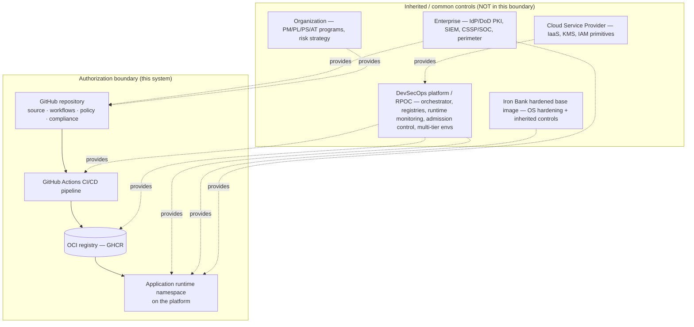

# Architecture

## Pipeline architecture

```mermaid
flowchart TD
  subgraph GH["GitHub (everything happens here)"]
    SRC[Source repo<br/>app + Dockerfile + IaC + workflows + policy + compliance]
    subgraph CI["GitHub Actions"]
      BT[build-test<br/>pytest + coverage]
      SAST[sast<br/>CodeQL + Semgrep]
      SCA[sca<br/>Trivy fs · Grype · Dependency-Check]
      SBOM[sbom<br/>Syft → SPDX + CycloneDX]
      LIC[license<br/>OSS policy vs allowed-licenses.yaml]
      SEC[secrets<br/>Gitleaks · TruffleHog · push protection]
      IAC[iac<br/>Checkov · KICS · Trivy-config · kube-linter · Conftest/OPA]
      CON[container<br/>build → Trivy/Grype image scan → Hadolint/Dockle → Syft image SBOM → cosign sign → SLSA provenance → push GHCR]
      DAST[dast<br/>OWASP ZAP baseline vs running image]
      STIG[stig<br/>OpenSCAP eval + .ckl]
      SCORE[supply-chain<br/>OpenSSF Scorecard]
      BOE[body-of-evidence<br/>aggregate → map controls → POA&M → ConMon → eMASS package → dashboard data]
    end
    GHCR[(GHCR<br/>signed image + SBOM + SLSA attestations)]
    CODESCAN[GitHub code scanning<br/>SARIF from all SAST/SCA/IaC tools]
    REL[GitHub Releases<br/>emass-package.zip · SBOMs · POA&M · controls]
    PAGES[GitHub Pages<br/>AO dashboard]
    ISSUE[Pinned 'ATO Status' issue<br/>auto-updated]
    DEPB[Dependabot<br/>deps · actions · base image · terraform]
  end
  RPOC[[RPOC / DoD DevSecOps platform<br/>verify signature → deploy → runtime ConMon (inherited)]]
  EMASS[[eMASS<br/>controls · test results · POA&M · artifacts · HW/SW · PPSM]]

  SRC --> BT & SAST & SCA & SBOM & LIC & SEC & IAC & SCORE
  BT --> CON --> DAST & STIG
  SAST & SCA & IAC & CON & SCORE --> CODESCAN
  BT & SAST & SCA & SBOM & LIC & SEC & IAC & CON & DAST & STIG & SCORE --> BOE
  CON --> GHCR
  BOE --> PAGES & REL & ISSUE
  DEPB --> SRC
  GHCR --> RPOC
  REL --> EMASS
  PAGES -. reviewed by .-> AO[(AO / SCA / ISSM)]
  AO -. authorization decision .-> EMASS
```

## DevSecOps lifecycle ↔ gates

```mermaid
flowchart LR
  Plan -->|arch/threat model, security reqs as code| Develop
  Develop -->|branch protection, CODEOWNERS, secret scan| Build
  Build -->|SAST · SCA · SBOM · license · IaC · container build/scan/sign/provenance| Test
  Test -->|DAST · STIG/SCAP · coverage · pen test| Release
  Release -->|eMASS package, signed release, ISSM review (RAISE Gate 6)| Deliver
  Deliver -->|signed image in GHCR (RAISE Gates 7,8)| Deploy
  Deploy -->|hardened k8s manifests, admission control| Operate
  Operate -->|hardened container, least privilege| Monitor
  Monitor -->|Scorecard, daily re-scan, SIEM (inherited), ConMon trend| Feedback
  Feedback -->|findings → POA&M → PRs| Plan
```

(See `compliance/crosswalks/devsecops-reference-design-crosswalk.md` for the full mapping to the
DoD Enterprise DevSecOps Reference Design family + Activities & Tools Guidebook.)

## Authorization boundary (replace with your real one)



## Data flow (sample app — replace)

```mermaid
sequenceDiagram
  participant Client as Authorized client
  participant Ing as Platform ingress (TLS 1.2+ termination)
  participant App as sample-app (gunicorn/Flask, non-root, read-only fs)
  Client->>Ing: HTTPS request (TLS)
  Ing->>App: HTTP request (in-cluster; mesh mTLS where used) :8080
  App-->>Ing: JSON response + security headers (CSP, X-Content-Type-Options, ...)
  Ing-->>Client: HTTPS response
  Note over App: No persistent local storage. Secrets from the platform vault.<br/>Logs to stdout → platform logging/SIEM (inherited).
```

Replace the sample-app diagrams with your workload's real components, user connections, external
system connections, and data flows — this is a **RAISE App-Owner artifact** (the Application
Architecture diagram) and feeds the SSP §4–§7.
